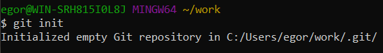
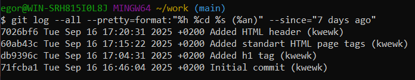
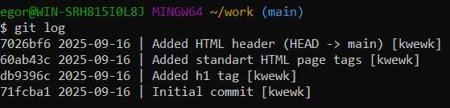
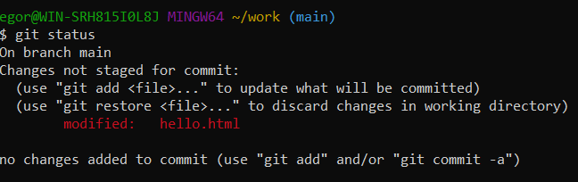
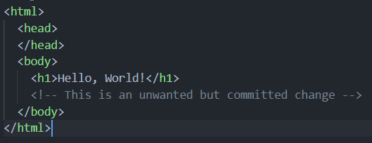
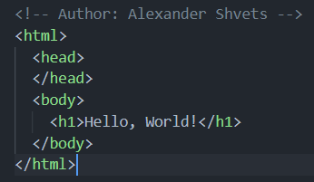
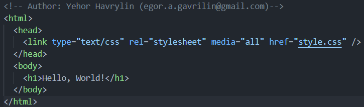

# Практичне заняття №1  
**Проходження інтерактивного курсу "Git How To"**  

## Виконане завдання
У межах практичного заняття ознайомився з базовими командами та принципами роботи з системою контролю версій Git шляхом проходження інтерактивного навчального курсу.

### Рівень проходження (Частина 1 + Частина 2)
- **Частина 1** (базові операції):  
  - ініціалізація репозиторію  
  - додавання та коміти файлів  
  - перегляд історії  
  - скасування змін  
  - робота з гілками  

- **Частина 2** (розширені операції):  
  - злиття гілок  
  - вирішення конфліктів  
  - використання тегів  
  - робота з віддаленим репозиторієм  

---

## Скріншоти виконання

[1.1]  
  

[1.2]  
  

[1.3]  
  

[2.1]  
  

[2.2]  
  

[2.3]  
  

[3.1]  
  

[4.1]  
  

[4.2]  
  

[5.1]  
  

[7.1]  
  

[7.1.1]  
  

[7.2]  
  

[8.1]  
  

[8.2]  
  

[8.3]  
  

[8.4]  
  

[8.5]  
  

[8.6.1]  
  

[8.6.2]  
  

[8.7]  
  

[9.1]  
  

[9.2]  
  

[9.3]  
  

[9.4]  
  

[10.1.1]  
  

[10.1.2]  
  

[10.2]  
  

[11.1]  
  

[11.2]  
  

[11.3]  
  

[11.4]  
  

[11.5]  
  

[12.1]  
  

[12.2]  
  

[12.3]  
  

[12.4]  
  

[13.1.1]  
  

[13.1.2]  
  

[13.2]  
  

[13.3]  
  

[13.4]  
  

[14.2.1]  
  

[14.2.2]  
  

[14.3]  
  

[14.4]  
  

[15.3]  
  

[15.4]  
  

[15.5]  
  

[16.1]  
  

[17.1.1]  
  

[17.1.2]  
  

[17.2]  
  

[17.3]  
  

[17.4]  
  

[18.1]  
  

[18.2.1]  
  

[18.2.2]  
  

[18.3.1]  
  

[18.3.2]  
  

[19.1]  
  

[19.2]  
  

[20.1]  
  

[20.2]  
  

[20.3]  
  

[20.4]  
  

[21.1]  
  

[21.2]  
  

[22]  
  

[23]  
  

[24.1.1]  
  

[24.1.2]  
  

[24.2]  
  

[25.1.1]  
  

[25.1.2]  
  

[25.1.3]  
  

[25.1.4]  
  

[25.2]  
  

[25.3]  
  

[25.4]  
  

[27.1]  
  

[27.2]  
  

[28.1]  
  

[28.2]  
  

[29.1]  
  

[29.2]  
  

[30.1]  
  

[30.2]  
  

[31.1]  
  

[31.2]  
  

[32]  
  

[33]  
  

[34]  
  

[35]  
  

[35.1]  
  

[36.1]  
  

[36.2]  
  

[37.1]  
  

[38.1]  
  

[39]  
  

[40]  
  

[41]  
  

[42]  
  

[42.1]  
  

---

### Висновок
На мій погляд, це була вкрай корисна робота, тому що гіт є невід'ємною частиною життя програміста, а також стане в нагоді в роботі.
